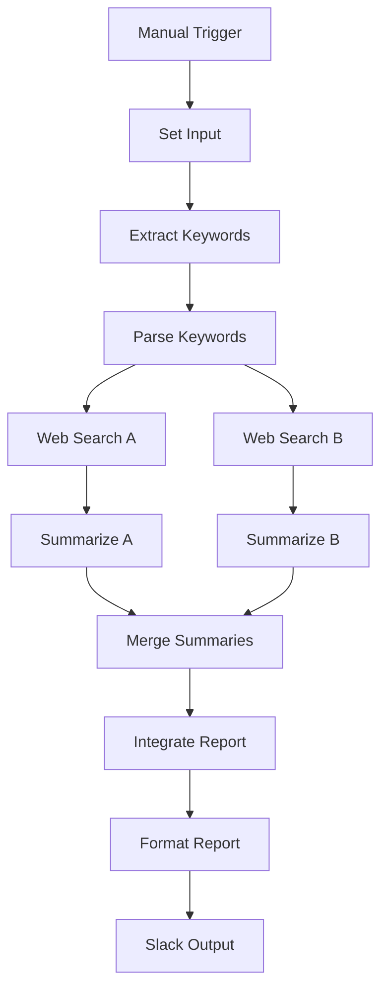

# Claude Code Multi-Branch Analysis - セットアップガイド

## 概要

最適化された**Claude Code Multi-Branch Analysis**ワークフローは、元のカスタムClaudeノードを標準のn8nノードに置き換え、実用的なテンプレートとして作成されました。

## 主要な改善点

### 🔧 技術的最適化

1. **カスタムノードの置換**
   - `custom.claude.mcp` → `n8n-nodes-base.httpRequest`
   - Claude API直接呼び出しによる安定性向上

2. **Web検索機能の実装**
   - Serper API統合によるリアルタイム検索
   - フォールバック機能でエラー耐性向上

3. **データフロー改善**
   - Set/Function ノードによる適切なデータ変換
   - Merge ノードによる並列処理結果の統合

4. **エラーハンドリング強化**
   - 各APIコールに `onError: "continueRegularOutput"`
   - JSONパースエラー対応
   - デフォルト値による継続実行

## 環境変数設定

```bash
# 必須API キー
export CLAUDE_API_KEY="sk-ant-..."
export SERPER_API_KEY="your-serper-key"

# Slack統合（オプション）
export SLACK_BOT_TOKEN="xoxb-..."
```

## ワークフロー構成

### ノード構成（13ノード）

1. **Manual Trigger** - 手動実行トリガー
2. **Set Input Data** - 入力データ設定
3. **Extract Search Terms** - Claude APIでキーワード抽出
4. **Parse Keywords** - JSON応答の解析
5. **Web Search A/B** - 並列Web検索（Serper API）
6. **Summarize A/B** - 各検索結果の要約（Claude API）
7. **Merge Summaries** - 要約結果の統合
8. **Integrate & Report** - 最終レポート生成（Claude API）
9. **Format Final Report** - Markdownフォーマット
10. **Slack Output** - Slack通知

### データフロー



## 使用方法

### 1. n8nでの読み込み

```bash
# テンプレートファイルをn8nにインポート
curl -X POST "http://localhost:5678/api/v1/workflows" \
  -H "Content-Type: application/json" \
  -d @workflows/templates/multi-branch-analysis-template.json
```

### 2. 環境変数の設定

n8n設定で以下を追加：
- `CLAUDE_API_KEY`
- `SERPER_API_KEY`
- `SLACK_BOT_TOKEN` (オプション)

### 3. 実行

1. Manual Triggerを起動
2. 分析したいトピックを入力（デフォルト：「AI技術と医療応用」）
3. ワークフローが自動実行され、Slackに結果通知

## API制限と考慮事項

### Claude API
- 1分あたり500リクエスト制限
- 1リクエストあたり最大4096トークン

### Serper API
- 無料プランで月100検索
- レスポンス時間: 1-3秒

### 推奨設定
- タイムアウト: 30秒
- リトライ: 3回
- 並列実行制限: 2ノード同時

## トラブルシューティング

### よくあるエラー

1. **Claude API エラー**
   ```
   Error: 401 Unauthorized
   ```
   → API キーの確認

2. **Serper API エラー**
   ```
   Error: API quota exceeded
   ```
   → API制限の確認、デモキーの使用

3. **JSON パースエラー**
   → Function ノードのフォールバック機能で継続実行

### デバッグモード

```javascript
// Function ノード内でのデバッグ
console.log('Debug:', JSON.stringify(items, null, 2));
```

## カスタマイズ

### 検索結果数の調整

Web Search ノードで `num` パラメータを変更：
```json
{
  "name": "num",
  "value": "10"  // 5 → 10に変更
}
```

### Claude モデルの変更

HTTP Request ノードで `model` パラメータを変更：
```json
{
  "name": "model",
  "value": "claude-3-opus-20240229"  // より高性能なモデル
}
```

### 出力フォーマットの変更

Format Final Report ノードのテンプレートを編集してカスタマイズ可能。

---

**Generated by Claude Code Multi-Branch Analysis Optimization**  
*最終更新: 2025-08-04*